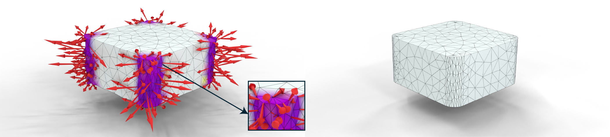

# [Siggraph 2025] Geometric Contact Potential

A reference implementation of the Siggraph 2025 paper [Geometric Contact Potential](https://huangzizhou.github.io/research/smooth-contact.html) based on [PolyFEM](https://github.com/polyfem/polyfem).

Compilation
-----------

All the C++ dependencies required to build the code are included. It should work on Windows, macOS, and Linux, and it should build out-of-the-box with CMake:

    mkdir build
    cd build
    cmake ..
    make -j4

Usage
-----

The main executable, `./PolyFEM_bin`, can be called with a GUI or through a command-line interface. Simply run:

    ./PolyFEM_bin

A more detailed documentation can be found on the [website](https://polyfem.github.io/).

Unit Tests
-----

Examples of running simulations using the Geometric Contact Potential can be found under [contact-tests](./contact-tests/). More examples on the paper will be added.